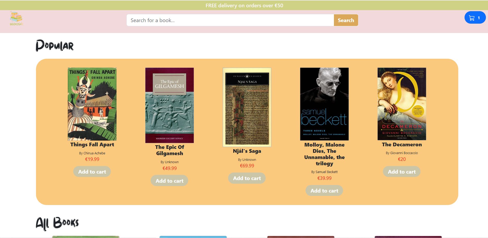
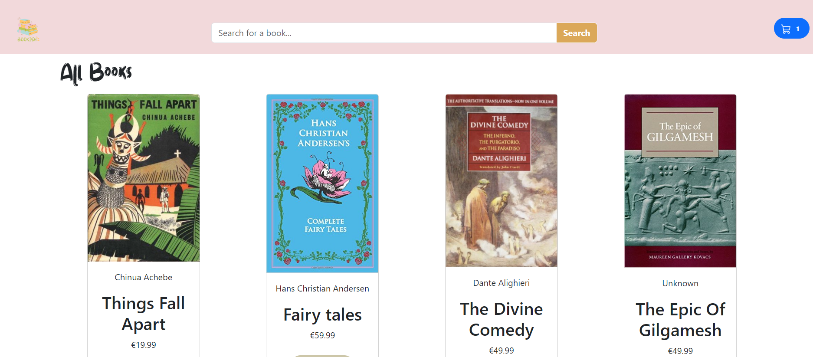
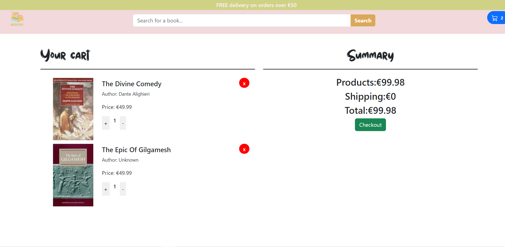

# Shop cart e-commerce simple app

This is a simple e-commerce project that allows users to add items to a cart, remove items from the cart, and view the total amount to pay.
Users can also search books and see result page.

## Getting Started

To get started with this project, you can clone this repository to your local machine:

### git clone (HTTP link)

In the project directory, you can run:

### `npm start`

Runs the app in the development mode.\
Open [http://localhost:3000](http://localhost:3000) to view it in your browser.

The page will reload when you make changes.\
You may also see any lint errors in the console.

## Live version

https://main--bookish-shop.netlify.app/

## Using the Application

Once the application is running, you can add items to the cart by clicking the "Add to Cart" button next to each item. You can remove items from the cart by clicking the "Remove" button next to each item in the cart.

The total amount to pay will be displayed.

## Technologies

- Javascript
- Bootstrap
- HTML
- CSS
- Git/Github
- React js

## Features

- Popular books
- Searching in book data and returning results on result page
- Usr can add items to the cart
- User can see total for items to pay

## Website overview

